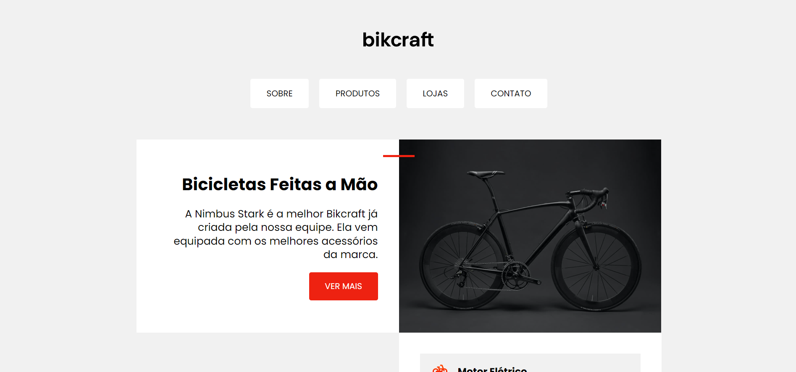

# FlexBlog ([Click Here](https://netinhoalves.github.io/Bikcraft/))

## SOBRE ESTE PROJETO!

Este é um desafio proposto pelo professor [André Rafael](https://www.youtube.com/origamid) no começo do curso "HTML e CSS para Iniciantes", onde estou aprendendo muito sobre HTML5 e CSS3 e conseguindo implementar, não só neste desafio como em meus projetos pessoais. Este desafio é o resultado de tudo que aprendi em aula.

## Tecnologias usadas

- HTML5
- CSS3
- CSS FlexBox
- CSS Grid Layout
- Media-queries
- Responsive Website

## Acessar minha resolução

Eu hospedei este desafio com a ajuda do GitHub Pages, para acessar minha resolução deste desafio [Clique Aqui](https://netinhoalves.github.io/Bikcraft/)
